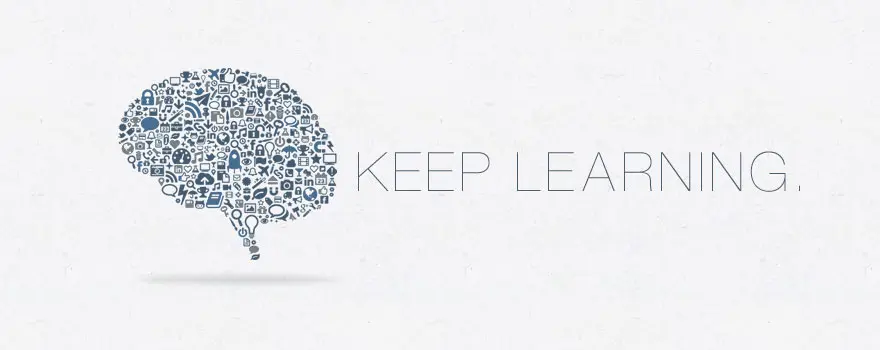

# Contents

- [Summary](#summary)
- [Communities](#communities)
- [Curriculum](#curriculum)
- [Code of conduct](#code-of-conduct)

# Summary

This roadmap provides a structured, self-paced program equivalent to a 4-year undergraduate foundation in [Field]. 

## Organization

This repository is organized into three main components:

- **Core Curriculum** (this page): the foundational knowledge of the field;
- **[Advanced Topics](advanced_topics.md)**: focused study in specific areas;
- **[Projects](projects.md)**: support learning through practical application throughout the curriculum.

**Process:** Learners may work through the curriculum independently or collaboratively, and either sequentially or selectively.

- For simplicity, courses in the Core Curriculum are ordered according to their prerequisites.
- The Core Curriculum provides a shared foundation and is intended to be completed in full.
- Advanced Topics are optional; learners are encouraged to select one area of focus and complete all courses within that topic.

Practical work is integrated through the [Projects section](projects.md) and may be undertaken alongside coursework.

Note: When there are courses or books that don't fit into the curriculum but are otherwise of high quality,
they belong in [extras/courses](extras/courses.md), [extras/readings](extras/readings.md).

**[How to contribute](/CONTRIBUTING.html)**

# Community

- There might be one on Discord.
- You can also interact through GitHub issues. If there is a problem with a course, or a change needs to be made to the curriculum, this is the place to start the conversation. Read more [here](CONTRIBUTING.md).

# Curriculum

- [Prerequisites](#prerequisites)
- [Intro](#intro-cs)
- [Core](#core-cs)
- [Advanced](#advanced-cs)
- [Final project](#final-project)

---

## Prerequisites

....

## Intro CS

This course will introduce you to the world of [Field]. This course gives you a flavor of the material to come. If you finish the course wanting more, [Field] is likely for you!

**Topics covered**:
`computation`
`imperative programming`
`basic data structures and algorithms`
`and more`

Courses | Duration | Effort | Prerequisites | Discussion
:-- | :--: | :--: | :--: | :--:

## Core [Field]

All coursework under Core CS is **required**, unless otherwise indicated.

### Core [topic 1]

Courses | Duration | Effort | Prerequisites | Discussion
:-- | :--: | :--: | :--: | :--:

## Congratulations

After completing the requirements of the curriculum above,
you will have completed the equivalent of a full bachelor's degree in [Field].
Congratulations!

# Code of conduct
[Hocbigg's code of conduct](https://github.com/hocbigg/code-of-conduct).
